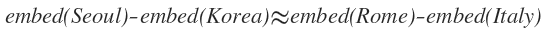
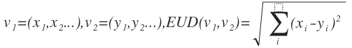
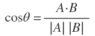

## text 처리
- 문자 -> 숫자 변환(vector 등)
    - word를 vector로 변환, document를 vector로 변환 등
    - bag of words
        - word dictionary를 만든 후, word의 순서를 고려하지 않고 count만 고려하여 vectorize 하는 방법
        - integer 값을 갖는 vector
    - word embedding
        - 다양한 방법으로(embedding에 여러가지 방법이 있음) word를 real-number vector화 하는 방법
        - vector간의 연산이 가능함
            - ex) 
    - data가 적은 경우에는 bag of words, tf-idf 등의 방법도 충분히 잘 됨
        - 단 data가 많아질수록 word embedding이 잘됨

- 유사하다의 정의(== vector의 유사도 정의)
    - euclid distance
        - 두 벡터 사이의 거리
        - aka L2 norm of vector
        - 
    - cosine similarity
        - cosine 값을 이용한 similarity
        - 
    - text 관련 문제에서는 cosine similarity를 많이 씀
        - 방향에 대한 고려 가능
            - ex) s1 = 'Love Love Love', s2 = 'Love Love Hate', s3 = 'Love Love' 에서 s2보다 s3가 s1과 더 유사하다고 판단할 수 있음

## MISC
- os.path.join을 사용하는 이유
    - window와 mac/linux에서 path seperator가 다름
        - widnow: \
        - mac, linux: /