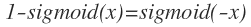

# 01. learning_prob
- Learning from data의 조건
    - explicit한 수학적 modeling이 어려움 => 만약 가능하면 그것으로 모델링하면 됨
    - empirical modeling을 위한 충분한 data가 있어야함
    - 정리: 매우 복잡해서 수학적인 modeling은 어렵지만 충분한 data가 있어서 `자동`으로 학습하는것이 가능한 경우 `Learning from data`가 가능함
    - 예시
        1. 주어진 자연수에 대해서 소수 판별 => 수학적 modeling 가능
        2. 높이 h에서 자유낙하한 물체가 지면에 도달할 때까지 걸리는 시간 => 수학적 modeling 가능(물론 수많은 data로부터 학습도 가능)
        3. 신용카드 사용 패턴으로부터 이상행동 감지 => 수학적으로 modeling하기 어려움
- Perceptron
    - 하나의 계산 component
    - 주어진 에 대해서 로 계산(weighted sum)
    - 이때 w와 x의 관계가 `linear`함
- learning model의 구성 요소
    - hypothesis => 실제 예측 모델
        - 예를들어 1차원 regression 문제에서 `y=ax+b로 예측하는 수식`
    - learning algorithm => hypothesis 중 가장 optimal한 것을 찾는 방법
        - 위의 `y=ax+b`에서 optimal한 a와 b를 찾는 과정
        - PLA(Perceptron Learning Algorithm)
            - learning algorithm의 한가지 방법
            - train data, train label(), hypothesis() 일 때 임의의 mis-classify한 example에 대해서()  수행
            - y=1인 경우, w와 x의 cosine값을 줄이는 방향으로 update
            - y=-1인 경우, w와 x의 cosine값을 키우는 방향으로 update
            - 주어진 data과 linearly separable하지 않으면 iteration이 끝나지 않음
- machine learning problem 종류
    - 크게 supervised / unsupervised / reinforce의 3가지 종류
    - correct label(정답)의 유무
        - supervised: correct label 존재
        - unsupervised: correct label 존재하지 않음
        - reinforce: correct label은 없지만 possible label이 있고 해당 label에 대하여 평가(grade) 가능 => 평가가 가장 좋은 방법을 계속 찾도록 함
    - 주요 problem
        - supervised
            - regression(real value 예측)
            - classification(discrete value 예측)
        - unsupervised
            - clustering ex) k-means 등
            - feature extraction(PCA, SVD 등)
                - label은 없지만 clustering의 경우 비슷한 것들을 비슷한 vector로 나타내면 feature extraction의 효과가 있음
        - reinforcement
            - 가능한 action과 그에 대한 grade를 통해 학습하는 환경 ex) AlphaGo, Auto mobile

# 02. feasibility_learning
- learning의 목표: f라는 unknown function을 알아내야함, 그러나 unseen data에 있는 어떤 성질까지 완벽히 알아내는 것은 `불가능` => `probabilistic way`로 f와 최대한 비슷한 g를 알아내보자
- red와 green공이 들어있는 항아리에서 공을 뽑을때 어떤 색깔이 뽑힐지 예측하기
    - 한두번 뽑아보는 것으로 예측하기 어렵지만 충분히 여러번 `독립적으로` 뽑아보면 red공이 나올 `probabilty`를 구할 수 있음
- Hoefdding Inequality
    - |<실험을 통해 계산한 probability> - <실제 probability>|가 upper bound K를 갖는데, K는 <실험 횟수>가 커질수록 작아짐()
    - **즉 충분히 실험을 많이 하면(sample을 많이 뽑으면) ground truth에 근사한 function g를 알아낼 수 있음**
- in-sample vs out-sample:
    - in-sample: random but can calculate
    - out-sample: fixed but cannot calculate
- Ein: in-sample error, Eout: out-sample error
- Machine Leanring의 목표: Eout -> 0
    - 그러나 실제로는 불가능(unseen data에 대해서 Eout을 측정조차 할 수 없음)
    - Hoefdding Inequality에서 |Ein - Eout|이 N에 의해서 upper bound가 정해지므로 다음의 2가지를 해결해보자
        1. |Ein - Eout|을 0에 가깝게 만들자(train error ~= test error로 만들자)(== generalization)
        2. Ein을 0에 가깝게 만들자(train error를 0으로 만들자)(== approximation)
        - 1과 2를 동시에 만족하면 Eout이 0이 된다!
        - 그러나 1과 2는 trade off가 있음
            - model의 complexity를 올리면 Ein이 0에 가까워지지만 |Ein - Eout|이 커짐(over fitting)
            - model의 complexity를 낮추면 |Ein - Eout|이 0에 까까워지지만 Ein이 커짐(under fitting)
- error
    - 실제 f와 우리의 hypothesis h의 차이를 measure하는 방법
    - `error measure`를 어떻게 하는지가 매우 중요!
    - False Positive vs False Negative는 문제에 따라 중요도가 다름 => **정하기가 어려우면 유명한/빈번히 쓰이는 meauser을 쓰자!**
- noise
    - error와는 다른 개념으로 f에 naturally 섞여 있는것
    - 같은 input x에 대해서 다른 결과 y가 나오게함
    - **f는 determinstic이 아니라 probabilistic함!**

# 03. linear_class_regress
- linear problems
    - classification: predict discrete value
    - regression: predict continuous value
    - logistic regression
        - regression에서 알 수 있듯이 continuous한 value를 예측, 다만 이 value는 0~1사이 값을 갖는 확률값임
        - 즉 확률예측(probability estimation)
        - Neural Network에서의 neuron
    - data가 linearly seperable한 경우(선으로 region이 나누는 경우): linear classification 가능
    - data가 linearly seperable하지 않은 경우(선으로 region이 나뉘지 않는 경우): non-linear transformation 후 linear classification 적용
- linear classification
    - linear model을 이용하여 주어진 data를 classify하는 task
    - 편의를 위해 binary classification이라고 가정하면
    - hypothesis: 
    - 즉 (signal 이라고도 함)가 0보다 크거나 같으면 1, 작으면 0으로 판단
    - pocket algorithm: 매번 `모든 train data`를 이용하여 in-sample error를 구하고 가장 error가 작을때의 weight을 저장해 놓는 알고리즘
- linear regression
    - 주어진 data에 가장 fit하는(==sample error를 minimize하는) line(다차원의 경우 hyper-plane)을 정하는 일
    - iterative한 과정으로 optimal을 찾지 않고 직접 close form solution을 이용할 수 있음
        - 예를들어 입력이 1차원일 때, MSE는 parameter에 대한 2차방정식이고 이는 grad=0인 지점을 한방에 수식으로 찾을 수 있음
    - regression
        - 주어진 x, y에 대해서 x, y사이의 관계를 찾는 통계학적인 방법
        - 우리의 주어진 x, y에 대해서 로 정의하고 을 최소로하면 w와 b를 찾으면 됨
        - 위의 식을 최소화하는데에는 2가지 방법이 있음
            - gradient descent(iterative한 방법)
                - 매 iteration마다 현재 지점에서 gradient를 구하고 그 반대방향으로 step을 이동하는 방법
            - closed-form solution
                - 위의 식은 w에 대한 2차 방적식으로 볼 수 있음 => 최소값을 explicit하게 구할 수 있음
                - 
                - 을 X의 `pesudo-inverse`라고 함
                    - X가 (m,n)(m!=n)이어서 X의 inverse를 직접 구할 수 없을 때, 간접적으로 x의 inverse를 구하는 방법
                - 이 invertible(역행렬존재)하면 pesudo-inverse를 통해 한번에 w를 계산할 수 있음
                - 이 singular(역행렬이 존재하지 않음)이면 수학적으로 근사한 pesudo-inverse를 이용해서 w를 한번에 계산할 수 있음(matrix inverse 말고 다른 방법을 이용하여 pesudo-inverse를 구하는 방법이 있음)

# 04. logistic_regression
- logistic regression
    - linear regression + sigmoid function
        - 
        - , 
    - output: real(regression) but bounded(sigmoid)
    - classification의 경우 output이 discrete value(0, 1, ...)로 나와야 하는데 logistic regression을 이용할 경우 output을 각 label에 대한 확률 값으로 해석할 수 있음
- error function of logistic regression
    - MSE(Mean Squared Error) 대신 XE(Cross Entropy Error) 이용
        - 
        - 두 분포가 얼마나 다른지를 측정하는 방법
        - XE가 MSE 보다 optimization에 좋음(XE는 convex function 이므로)
        - likelihood와 관련한 확률적 해석에 용이함
            - likelihood를 구하는 식과 동일함
        - 정답에서 벗어나는 경우에 대해 MSE 보다 크게 penalize함
            - 예를들어 정답이 1이고 예측 값(예측 확률)이 0.5인 경우
                - MSE => (1-0.5)^2 = 0.25
                - XE => -1*log(0.5) = 0.3
- gradient descent
    - 1차 미분계수(gradient)를 이용하여 minima를 찾는 방법
    - local minima 밖에 찾을 수 없음
        - global minima를 찾기위해 2차 미분계수를 이용할 수 있지만 cost 때문에 잘 사용하지 않음
    - `initial location이 매우 중요하고 initial locaion 근처의 local minima에서 멈춤, 다만 deep learning의 경우 차원이 매우 많기 때문에 local minima도 의미가 있음`
    - `error는 x(input)와 w의 함수로 볼 수 있고 error를 minimize하게 위해 gradient descent를 이용하여 w의 값을 iteratively 변경할 수 있음`
    - w의 변경 방향과 크기
        - 방향
            - first order derivative(1차 미분계수)는 해당 function이 가장 급격하게 증가하는 방향을 알려줌 => gradient의 반대 방향으로 이동하면 function이 가장 급격하게 감소하는 방향
        - 크기(step size)
            - 잘못된 step size는 오히려 발산으로 이어짐
                - 
            - 처음에는 크게하고 점차 줄이는 것이 좋음
                - intuition example: Rome 여행지 -> Seoul 집을 이동할 때, 비행기(Rome공항 -> Seoul공항), 버스(Seoul공항 -> 집 버스정류장), 걷기(집 버스정류장->집) 순으로 이동하는 것이 좋음
            - decaying learning rate
                - iteration step에 따라 learning rate(==step size의 계수)를 줄이는 방법
            - gradient 자체를 이용하는 방법
                - minima에 가까워질수록 gradient 값도 감소함 => step size를 줄이는 효과가 있음
                - 
        - stop condition
            - 언제 iteration을 멈출지 정하는 것은 매우 어려운 issue임
            - 보통 몇번의 iteration마다 validation accuracy를 측정해서 validation accuracy가 가장 낮은 시점에서 멈추는 방법을 사용

## MISC
- likelihood에 관한 정리
    - probability: 주어진 확률 분포에서 어떤 관측값이 일어날 확률(given: distribution)
    - likelihood: 주어진 관측값이 있을 때 해당 확률분포로 부터의 관측값일 확률(given: observation)
    - ML task에서 우리는 주어진 관측값이 있고 그 관측값을 바탕으로 전체 data에 대한 확률분포를 예측함 -> model의 parameter가 확률분포를 나타낸다고 해석할 수 있음
    - 주어진 관측값이 parameter로 표현되는 확률분포를 따를 확률을 likelihood라고 하고 이것을 maximize 하는 parameter를 찾는 것이 ML의 목표 -> MAXIMUM LIKELIHOOD ESTIMATION을 수행함
    - 주어진 관측값 이 IID(Independent and Identically Distributed), 즉 각각의 관측값이 독립적이며 똑같은 분포로 부터의 sample이라면 likelihood는 다음과 같이 계산할 수 있음 => 
    - Likelihood를 maximize하는 를 구하는 것은 Log(Likelihood)를 maximize하는 것과 같음(log 함수는 monotonically increasing 이므로) => Log Likelihood 
    - Log Likelihood를 maximize 하는 것은 Negative Log Likelihood를 minimize하는 것과 같음